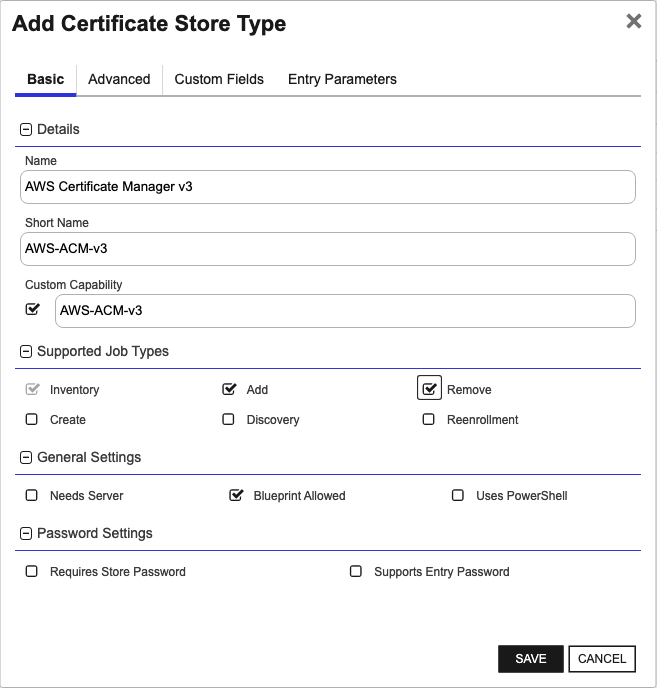
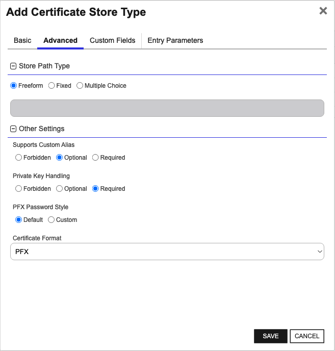
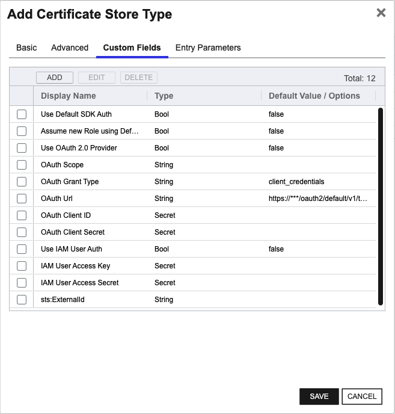
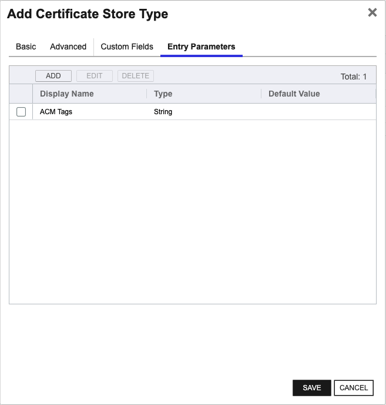

<h1 align="center" style="border-bottom: none">
    AWS Certificate Manager (ACM) Universal Orchestrator Extension
</h1>

<p align="center">
  <!-- Badges -->

<a href="https://github.com/Keyfactor/aws-orchestrator/releases"></a>


</p>

<p align="center">
  <!-- TOC -->
  <a href="#support">
    <b>Support</b>
  </a>
  ·
  <a href="#installation">
    <b>Installation</b>
  </a>
  ·
  <a href="#license">
    <b>License</b>
  </a>
  ·
  <a href="https://github.com/orgs/Keyfactor/repositories?q=orchestrator">
    <b>Related Integrations</b>
  </a>
</p>

## Overview

AWS Certificate Manager is a service that lets you easily provision, manage, and deploy public and private Secure Sockets Layer/Transport Layer Security (SSL/TLS)
certificates for use with AWS services and your internal connected resources.
SSL/TLS certificates are used to secure network communications and establish the identity of websites over the Internet as well as resources on private networks.
AWS Certificate Manager removes the time-consuming manual process of purchasing, uploading, and renewing SSL/TLS certificates.
The orchestrator supports OAuth OIDC authentication, as well as AWS IAM accounts, and various options provided by the AWS SDK such as EC2 instance credentials.
The OAuth OIDC support allows authentication against a 3rd party identity provider in AWS.
After initial authentication, temporary credentials are used by using the Assume Role functionality in AWS.

This integration also supports the reading of existing certificate ACM key/value pair tags during inventory and adding these tags when adding new certificates.
Modifying and adding ACM tags during certificate renewal, however, is NOT supported.
This is due to the fact that the AWS API does not allow for ACM tag modification when updating a certificate in one step.
This would need to be done in multiple steps, leading to the possibility of the certificate being left in an error state if any intermediate step were to fail.
However, while the modification/addition of ACM tags is not supported, all existing ACM tags WILL remain in place during renewal.
 
### Documentation

- [How AWS works in this extension (aws-auth-library)](https://github.com/Keyfactor/aws-auth-library)
- [AWS Region Codes](https://docs.aws.amazon.com/AmazonRDS/latest/UserGuide/Concepts.RegionsAndAvailabilityZones.html)


## Compatibility

This integration is compatible with Keyfactor Universal Orchestrator version 10.1 and later.

## Support
The AWS Certificate Manager (ACM) Universal Orchestrator extension If you have a support issue, please open a support ticket by either contacting your Keyfactor representative or via the Keyfactor Support Portal at https://support.keyfactor.com.

> To report a problem or suggest a new feature, use the **[Issues](../../issues)** tab. If you want to contribute actual bug fixes or proposed enhancements, use the **[Pull requests](../../pulls)** tab.

## Requirements & Prerequisites

Before installing the AWS Certificate Manager (ACM) Universal Orchestrator extension, we recommend that you install [kfutil](https://github.com/Keyfactor/kfutil). Kfutil is a command-line tool that simplifies the process of creating store types, installing extensions, and instantiating certificate stores in Keyfactor Command.


### Migrate existing ACM stores to the new type (AWS Certificate Manager v3)

Field usage has changed in v3, notably:
* `ServerUsername` and `ServerPassword` are no longer used
  * Specific fields for IAM and OAuth are defined for credentials of those type
* `Store Path` only allows a __single__ AWS Region to be defined
  * The Entry Parameter for AWS Region is no longer used
* `Client Machine` requires the _full_ Role ARN to be used for Assume Role calls

As a result, previous Store Types are no longer supported, and Certificate Stores of those types need to be migrated to the v3 type.
Inventory jobs will need be to run after creating the new Certificate Stores to begin tracking those certificates again.
The deprecated Stores and Store Types can be deleted after they are no longer needed.

_Currently there is no provided migration utility to perform this programatically._

### Setting up AWS Authentication (Examples)

The following examples show potential configurations for Roles in AWS with different selected authentication methods.
Your configuration steps may differ depending on specific requirements of your use case.

> ![NOTE]
> Several different options are offered for authenticating with AWS.
> Documentation for how these options work is now located in the [aws-auth-library](https://github.com/Keyfactor/aws-auth-library) repository.

<details>
<summary>EC2 instance credentials using Default SDK and Assume Role</summary>

Select the `Use Default SDK Auth` option to allow the integration to load EC2 instance credentials.
If the EC2 Role assigned to the instance is intended as the Destination account identity to use with ACM, no additional Role needs to be configured.

If the EC2 Role assigned to the instance is only to be used initially, and a new Role ARN is designated as the Destination account in the `Client Machine` field,
then the `Assume new Role using Default SDK Auth` should also be selected.

### AWS Setup
_Note: In this scenario the AWS-ACM-v3 extension needs to be running inside of an EC2 instance._
1. Assign or note the existing IAM Role assigned to the EC2 instance running. [Found in EC2 here](docsource/images/ec2-instance-iam-role.gif).
2. Ensure a [Trust Relationship](https://docs.aws.amazon.com/directoryservice/latest/admin-guide/edit_trust.html) is setup for that role. [Example](docsource/images/ec2-role-arn-trust-relationship.gif).
3. Verify the permissions match the requirements for accessing ACM.

</details>


<details>
<summary>OAuth OIDC Identity Provider (Okta example)</summary>

Select the `Use OAuth` option for a certificate store to use an OAuth Identity Provider.

### AWS Setup
1. A 3rd party [Identity Provider](https://docs.aws.amazon.com/IAM/latest/UserGuide/id_roles_providers_create_oidc.html) similar to [this](docsource/images/AWSIdentityProvider.gif) needs to be setup in AWS.
2. An [AWS Role](https://docs.aws.amazon.com/IAM/latest/UserGuide/id_roles_create_for-user.html) needs to be created to be used with your Identity Provider.
3. Ensure the [Trust Relationship](https://docs.aws.amazon.com/directoryservice/latest/admin-guide/edit_trust.html) is setup for that role with the Identity Provider. [Example](docsource/images/AWSRole2.gif).
4. Verify the permissions match the requirements for accessing ACM.

### OKTA Setup
1. Ensure your Authorization Server Is Setup in OKTA.  Here is a [sample](docsource/images/OktaSampleAuthorizationServer.gif).
2. Ensure the appropriate scopes are setup in Okta.  Here is a [sample](docsource/images/OktaSampleAuthorizationServer-scopes.gif).
3. Setup an Okta App with similar settings to [this](docsource/images/OktaApp1.gif) and [this](docsource/images/OktaApp2.gif).

</details>


<details>
<summary>IAM User credentials to Assume Role</summary>

Select the `Use IAM` option for a certificate store to use an IAM User credential.

### AWS Setup
1. An [AWS Role](https://docs.aws.amazon.com/IAM/latest/UserGuide/id_roles_create_for-user.html) to Assume with your IAM User needs to be created.
2. Ensure a [Trust Relationship](https://docs.aws.amazon.com/directoryservice/latest/admin-guide/edit_trust.html) is setup for that role. [Example](docsource/images/AssumeRoleTrust.gif).
3. AWS does not support programmatic access for AWS SSO accounts. The account used here must be a [standard AWS IAM User](docsource/images/UserAccount.gif) with an Access Key credential type.
4. Verify the permissions match the requirements for accessing ACM.

</details>


## AWS-ACM-v3 Certificate Store Type

To use the AWS Certificate Manager (ACM) Universal Orchestrator extension, you **must** create the AWS-ACM-v3 Certificate Store Type. This only needs to happen _once_ per Keyfactor Command instance.


The AWS Certificate Manager v3 Store Type provides enhanced authentication options for managing certificates in ACM.
Each defined Certificate Store of this type targes a specific AWS Region with a specific Destination account in mind.
Therefore each Certificate Store instance is intended to represent a single Role's certificates in a single AWS Region.

Some authentication configurations do not adhere strictly to this, so when using the various methods offered in the Default SDK auth option,
a full understanding of how permissions work in AWS is recommended.
In most scenarios using the Default SDK option, the Assume Role flag should also be set to avoid confusion, and use the Role ARN in the `Client Machine` field as the Destination account.
The latest version of the Store Type supporting ACM (AWS Certificate Manager) is `AWS-ACM-v3`.
Previous store types are no longer supported and should be migrated to the new Store Type definition.
When migrating to the `AWS-ACM-v3` type please note that field usage has changed and does not map over directly.

> [!WARNING]
> When creating Certificate Stores, all available Secret type fields need to have a value set for them, even if that is "No Value".
> Failing to set these Secret fields, even when not in use, causes errors that may require database access to fix.


#### AWS Certificate Manager v3 Requirements

Configuring authentication with AWS requires understanding how the authentication flow works.
Depending on the intended authentication method, the required configuration in AWS may require one or more Roles with the correct permissions.

The intended Destination account, usually the Role ARN specified in the `Client Machine` field, which is the final identity used to perform the actual work in AWS ACM, needs the following permissions:

~~~
Inventory required actions:

    "acm:ListCertificates",
    "acm:GetCertificate",
    "acm:ListTagsForCertificate"

 Management required actions:

    "acm:DeleteCertificate",
    "acm:DescribeCertificate",
    "acm:ImportCertificate"
~~~


#### Supported Operations

| Operation    | Is Supported                                                                                                           |
|--------------|------------------------------------------------------------------------------------------------------------------------|
| Add          | ✅ Checked        |
| Remove       | ✅ Checked     |
| Discovery    | 🔲 Unchecked  |
| Reenrollment | 🔲 Unchecked |
| Create       | 🔲 Unchecked     |

#### Store Type Creation

##### Using kfutil:
`kfutil` is a custom CLI for the Keyfactor Command API and can be used to created certificate store types.
For more information on [kfutil](https://github.com/Keyfactor/kfutil) check out the [docs](https://github.com/Keyfactor/kfutil?tab=readme-ov-file#quickstart)
   <details><summary>Click to expand AWS-ACM-v3 kfutil details</summary>

   ##### Using online definition from GitHub:
   This will reach out to GitHub and pull the latest store-type definition
   ```shell
   # AWS Certificate Manager v3
   kfutil store-types create AWS-ACM-v3
   ```

   ##### Offline creation using integration-manifest file:
   If required, it is possible to create store types from the [integration-manifest.json](./integration-manifest.json) included in this repo.
   You would first download the [integration-manifest.json](./integration-manifest.json) and then run the following command
   in your offline environment.
   ```shell
   kfutil store-types create --from-file integration-manifest.json
   ```
   </details>


#### Manual Creation
Below are instructions on how to create the AWS-ACM-v3 store type manually in
the Keyfactor Command Portal
   <details><summary>Click to expand manual AWS-ACM-v3 details</summary>

   Create a store type called `AWS-ACM-v3` with the attributes in the tables below:

   ##### Basic Tab
   | Attribute | Value | Description |
   | --------- | ----- | ----- |
   | Name | AWS Certificate Manager v3 | Display name for the store type (may be customized) |
   | Short Name | AWS-ACM-v3 | Short display name for the store type |
   | Capability | AWS-ACM-v3 | Store type name orchestrator will register with. Check the box to allow entry of value |
   | Supports Add | ✅ Checked | Check the box. Indicates that the Store Type supports Management Add |
   | Supports Remove | ✅ Checked | Check the box. Indicates that the Store Type supports Management Remove |
   | Supports Discovery | 🔲 Unchecked |  Indicates that the Store Type supports Discovery |
   | Supports Reenrollment | 🔲 Unchecked |  Indicates that the Store Type supports Reenrollment |
   | Supports Create | 🔲 Unchecked |  Indicates that the Store Type supports store creation |
   | Needs Server | 🔲 Unchecked | Determines if a target server name is required when creating store |
   | Blueprint Allowed | ✅ Checked | Determines if store type may be included in an Orchestrator blueprint |
   | Uses PowerShell | 🔲 Unchecked | Determines if underlying implementation is PowerShell |
   | Requires Store Password | 🔲 Unchecked | Enables users to optionally specify a store password when defining a Certificate Store. |
   | Supports Entry Password | 🔲 Unchecked | Determines if an individual entry within a store can have a password. |

   The Basic tab should look like this:

   

   ##### Advanced Tab
   | Attribute | Value | Description |
   | --------- | ----- | ----- |
   | Supports Custom Alias | Optional | Determines if an individual entry within a store can have a custom Alias. |
   | Private Key Handling | Required | This determines if Keyfactor can send the private key associated with a certificate to the store. Required because IIS certificates without private keys would be invalid. |
   | PFX Password Style | Default | 'Default' - PFX password is randomly generated, 'Custom' - PFX password may be specified when the enrollment job is created (Requires the Allow Custom Password application setting to be enabled.) |

   The Advanced tab should look like this:

   

   > For Keyfactor **Command versions 24.4 and later**, a Certificate Format dropdown is available with PFX and PEM options. Ensure that **PFX** is selected, as this determines the format of new and renewed certificates sent to the Orchestrator during a Management job. Currently, all Keyfactor-supported Orchestrator extensions support only PFX.

   ##### Custom Fields Tab
   Custom fields operate at the certificate store level and are used to control how the orchestrator connects to the remote target server containing the certificate store to be managed. The following custom fields should be added to the store type:

   | Name | Display Name | Description | Type | Default Value/Options | Required |
   | ---- | ------------ | ---- | --------------------- | -------- | ----------- |
   | UseDefaultSdkAuth | Use Default SDK Auth | A switch to enable the store to use Default SDK credentials | Bool | false | ✅ Checked |
   | DefaultSdkAssumeRole | Assume new Role using Default SDK Auth | A switch to enable the store to assume a new Role when using Default SDK credentials | Bool | false | 🔲 Unchecked |
   | UseOAuth | Use OAuth 2.0 Provider | A switch to enable the store to use an OAuth provider workflow to authenticate with AWS | Bool | false | ✅ Checked |
   | OAuthScope | OAuth Scope | This is the OAuth Scope needed for Okta OAuth, defined in Okta | String |  | 🔲 Unchecked |
   | OAuthGrantType | OAuth Grant Type | In OAuth 2.0, the term 'grant type' refers to the way an application gets an access token. In Okta this is `client_credentials` | String | client_credentials | 🔲 Unchecked |
   | OAuthUrl | OAuth Url | An optional parameter sts:ExternalId to pass with Assume Role calls | String | https://***/oauth2/default/v1/token | 🔲 Unchecked |
   | OAuthClientId | OAuth Client ID | The Client ID for OAuth. | Secret |  | 🔲 Unchecked |
   | OAuthClientSecret | OAuth Client Secret | The Client Secret for OAuth. | Secret |  | 🔲 Unchecked |
   | UseIAM | Use IAM User Auth | A switch to enable the store to use IAM User auth to assume a role when authenticating with AWS | Bool | false | ✅ Checked |
   | IAMUserAccessKey | IAM User Access Key | The AWS Access Key for an IAM User | Secret |  | 🔲 Unchecked |
   | IAMUserAccessSecret | IAM User Access Secret | The AWS Access Secret for an IAM User. | Secret |  | 🔲 Unchecked |
   | ExternalId | sts:ExternalId | An optional parameter sts:ExternalId to pass with Assume Role calls | String |  | 🔲 Unchecked |

   The Custom Fields tab should look like this:

   

   ##### Entry Parameters Tab

   | Name | Display Name | Description | Type | Default Value | Entry has a private key | Adding an entry | Removing an entry | Reenrolling an entry |
   | ---- | ------------ | ---- | ------------- | ----------------------- | ---------------- | ----------------- | ------------------- | ----------- |
   | ACM Tags | ACM Tags | The optional ACM tags that should be assigned to the certificate.  Multiple name/value pairs may be entered in the format of `Name1=Value1,Name2=Value2,...,NameN=ValueN` | String |  | 🔲 Unchecked | 🔲 Unchecked | 🔲 Unchecked | 🔲 Unchecked |

   The Entry Parameters tab should look like this:

   

   </details>

## Installation

1. **Download the latest AWS Certificate Manager (ACM) Universal Orchestrator extension from GitHub.**

    Navigate to the [AWS Certificate Manager (ACM) Universal Orchestrator extension GitHub version page](https://github.com/Keyfactor/aws-orchestrator/releases/latest). Refer to the compatibility matrix below to determine whether the `net6.0` or `net8.0` asset should be downloaded. Then, click the corresponding asset to download the zip archive.

   | Universal Orchestrator Version | Latest .NET version installed on the Universal Orchestrator server | `rollForward` condition in `Orchestrator.runtimeconfig.json` | `aws-orchestrator` .NET version to download |
   | --------- | ----------- | ----------- | ----------- |
   | Older than `11.0.0` | | | `net6.0` |
   | Between `11.0.0` and `11.5.1` (inclusive) | `net6.0` | | `net6.0` |
   | Between `11.0.0` and `11.5.1` (inclusive) | `net8.0` | `Disable` | `net6.0` |
   | Between `11.0.0` and `11.5.1` (inclusive) | `net8.0` | `LatestMajor` | `net8.0` |
   | `11.6` _and_ newer | `net8.0` | | `net8.0` |

    Unzip the archive containing extension assemblies to a known location.

    > **Note** If you don't see an asset with a corresponding .NET version, you should always assume that it was compiled for `net6.0`.

2. **Locate the Universal Orchestrator extensions directory.**

    * **Default on Windows** - `C:\Program Files\Keyfactor\Keyfactor Orchestrator\extensions`
    * **Default on Linux** - `/opt/keyfactor/orchestrator/extensions`

3. **Create a new directory for the AWS Certificate Manager (ACM) Universal Orchestrator extension inside the extensions directory.**

    Create a new directory called `aws-orchestrator`.
    > The directory name does not need to match any names used elsewhere; it just has to be unique within the extensions directory.

4. **Copy the contents of the downloaded and unzipped assemblies from __step 2__ to the `aws-orchestrator` directory.**

5. **Restart the Universal Orchestrator service.**

    Refer to [Starting/Restarting the Universal Orchestrator service](https://software.keyfactor.com/Core-OnPrem/Current/Content/InstallingAgents/NetCoreOrchestrator/StarttheService.htm).


6. **(optional) PAM Integration**

    The AWS Certificate Manager (ACM) Universal Orchestrator extension is compatible with all supported Keyfactor PAM extensions to resolve PAM-eligible secrets. PAM extensions running on Universal Orchestrators enable secure retrieval of secrets from a connected PAM provider.

    To configure a PAM provider, [reference the Keyfactor Integration Catalog](https://keyfactor.github.io/integrations-catalog/content/pam) to select an extension and follow the associated instructions to install it on the Universal Orchestrator (remote).


> The above installation steps can be supplemented by the [official Command documentation](https://software.keyfactor.com/Core-OnPrem/Current/Content/InstallingAgents/NetCoreOrchestrator/CustomExtensions.htm?Highlight=extensions).


## Defining Certificate Stores


The latest version of the Store Type supporting ACM (AWS Certificate Manager) is `AWS-ACM-v3`.
Previous store types are no longer supported and should be migrated to the new Store Type definition.
When migrating to the `AWS-ACM-v3` type please note that field usage has changed and does not map over directly.

> [!WARNING]
> When creating Certificate Stores, all available Secret type fields need to have a value set for them, even if that is "No Value".
> Failing to set these Secret fields, even when not in use, causes errors that may require database access to fix.


### Store Creation

#### Manually with the Command UI

<details><summary>Click to expand details</summary>

1. **Navigate to the _Certificate Stores_ page in Keyfactor Command.**

    Log into Keyfactor Command, toggle the _Locations_ dropdown, and click _Certificate Stores_.

2. **Add a Certificate Store.**

    Click the Add button to add a new Certificate Store. Use the table below to populate the **Attributes** in the **Add** form.

   | Attribute | Description |
   | --------- | ----------- |
   | Category | Select "AWS Certificate Manager v3" or the customized certificate store name from the previous step. |
   | Container | Optional container to associate certificate store with. |
   | Client Machine | This is a full AWS ARN specifying a Role. This is the Role that will be assumed in any Auth scenario performing Assume Role. This will dictate what certificates are usable by the orchestrator. A preceeding [profile] name should be included if a Credential Profile is to be used in Default Sdk Auth. |
   | Store Path | A single specified AWS Region the store will operate in. Additional regions should get their own store defined. |
   | Orchestrator | Select an approved orchestrator capable of managing `AWS-ACM-v3` certificates. Specifically, one with the `AWS-ACM-v3` capability. |
   | UseDefaultSdkAuth | A switch to enable the store to use Default SDK credentials |
   | DefaultSdkAssumeRole | A switch to enable the store to assume a new Role when using Default SDK credentials |
   | UseOAuth | A switch to enable the store to use an OAuth provider workflow to authenticate with AWS |
   | OAuthScope | This is the OAuth Scope needed for Okta OAuth, defined in Okta |
   | OAuthGrantType | In OAuth 2.0, the term 'grant type' refers to the way an application gets an access token. In Okta this is `client_credentials` |
   | OAuthUrl | An optional parameter sts:ExternalId to pass with Assume Role calls |
   | OAuthClientId | The Client ID for OAuth. |
   | OAuthClientSecret | The Client Secret for OAuth. |
   | UseIAM | A switch to enable the store to use IAM User auth to assume a role when authenticating with AWS |
   | IAMUserAccessKey | The AWS Access Key for an IAM User |
   | IAMUserAccessSecret | The AWS Access Secret for an IAM User. |
   | ExternalId | An optional parameter sts:ExternalId to pass with Assume Role calls |

</details>


#### Using kfutil CLI

<details><summary>Click to expand details</summary>

1. **Generate a CSV template for the AWS-ACM-v3 certificate store**

    ```shell
    kfutil stores import generate-template --store-type-name AWS-ACM-v3 --outpath AWS-ACM-v3.csv
    ```
2. **Populate the generated CSV file**

    Open the CSV file, and reference the table below to populate parameters for each **Attribute**.

   | Attribute | Description |
   | --------- | ----------- |
   | Category | Select "AWS Certificate Manager v3" or the customized certificate store name from the previous step. |
   | Container | Optional container to associate certificate store with. |
   | Client Machine | This is a full AWS ARN specifying a Role. This is the Role that will be assumed in any Auth scenario performing Assume Role. This will dictate what certificates are usable by the orchestrator. A preceeding [profile] name should be included if a Credential Profile is to be used in Default Sdk Auth. |
   | Store Path | A single specified AWS Region the store will operate in. Additional regions should get their own store defined. |
   | Orchestrator | Select an approved orchestrator capable of managing `AWS-ACM-v3` certificates. Specifically, one with the `AWS-ACM-v3` capability. |
   | Properties.UseDefaultSdkAuth | A switch to enable the store to use Default SDK credentials |
   | Properties.DefaultSdkAssumeRole | A switch to enable the store to assume a new Role when using Default SDK credentials |
   | Properties.UseOAuth | A switch to enable the store to use an OAuth provider workflow to authenticate with AWS |
   | Properties.OAuthScope | This is the OAuth Scope needed for Okta OAuth, defined in Okta |
   | Properties.OAuthGrantType | In OAuth 2.0, the term 'grant type' refers to the way an application gets an access token. In Okta this is `client_credentials` |
   | Properties.OAuthUrl | An optional parameter sts:ExternalId to pass with Assume Role calls |
   | Properties.OAuthClientId | The Client ID for OAuth. |
   | Properties.OAuthClientSecret | The Client Secret for OAuth. |
   | Properties.UseIAM | A switch to enable the store to use IAM User auth to assume a role when authenticating with AWS |
   | Properties.IAMUserAccessKey | The AWS Access Key for an IAM User |
   | Properties.IAMUserAccessSecret | The AWS Access Secret for an IAM User. |
   | Properties.ExternalId | An optional parameter sts:ExternalId to pass with Assume Role calls |

3. **Import the CSV file to create the certificate stores**

    ```shell
    kfutil stores import csv --store-type-name AWS-ACM-v3 --file AWS-ACM-v3.csv
    ```

</details>


#### PAM Provider Eligible Fields
<details><summary>Attributes eligible for retrieval by a PAM Provider on the Universal Orchestrator</summary>

If a PAM provider was installed _on the Universal Orchestrator_ in the [Installation](#Installation) section, the following parameters can be configured for retrieval _on the Universal Orchestrator_.

   | Attribute | Description |
   | --------- | ----------- |
   | OAuthClientId | The Client ID for OAuth. |
   | OAuthClientSecret | The Client Secret for OAuth. |
   | IAMUserAccessKey | The AWS Access Key for an IAM User |
   | IAMUserAccessSecret | The AWS Access Secret for an IAM User. |

Please refer to the **Universal Orchestrator (remote)** usage section ([PAM providers on the Keyfactor Integration Catalog](https://keyfactor.github.io/integrations-catalog/content/pam)) for your selected PAM provider for instructions on how to load attributes orchestrator-side.
> Any secret can be rendered by a PAM provider _installed on the Keyfactor Command server_. The above parameters are specific to attributes that can be fetched by an installed PAM provider running on the Universal Orchestrator server itself.

</details>


> The content in this section can be supplemented by the [official Command documentation](https://software.keyfactor.com/Core-OnPrem/Current/Content/ReferenceGuide/Certificate%20Stores.htm?Highlight=certificate%20store).


## License

Apache License 2.0, see [LICENSE](LICENSE).

## Related Integrations

See all [Keyfactor Universal Orchestrator extensions](https://github.com/orgs/Keyfactor/repositories?q=orchestrator).